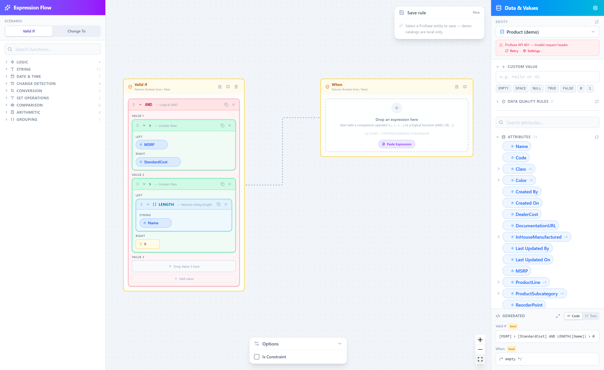
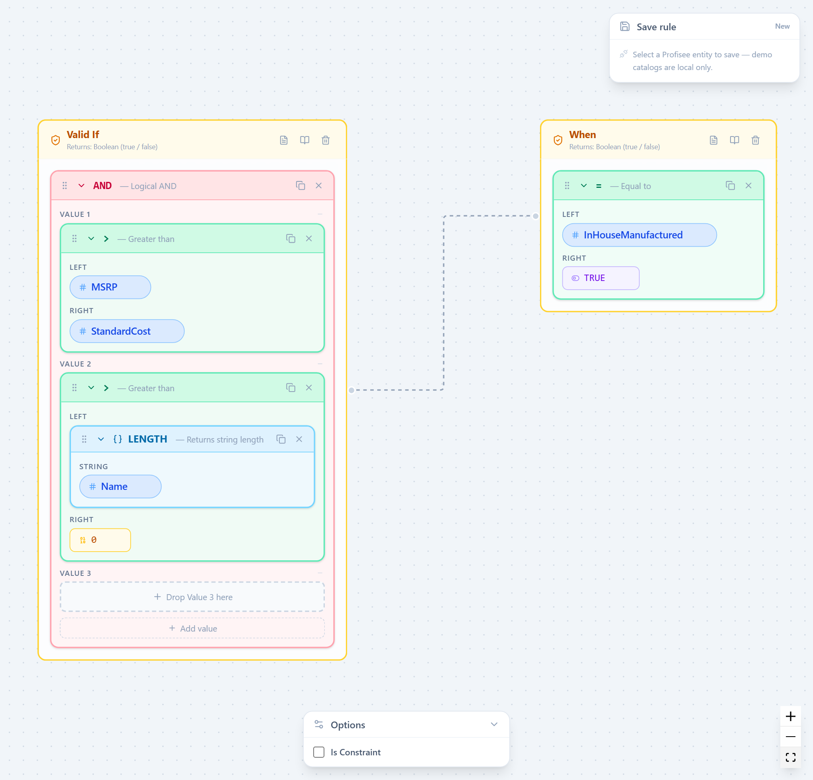
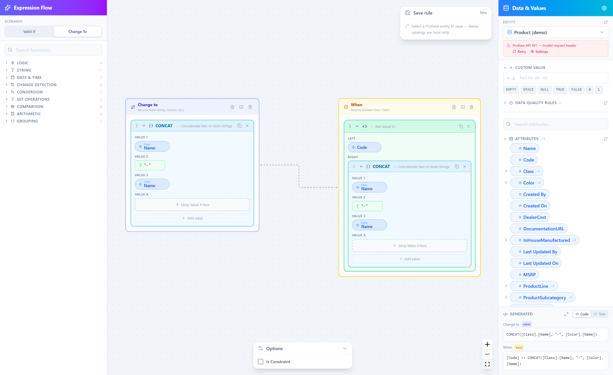
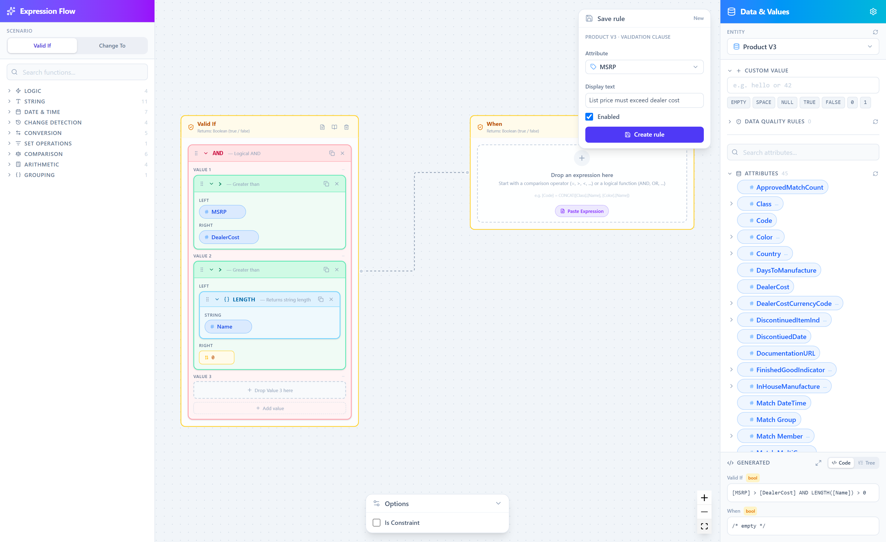
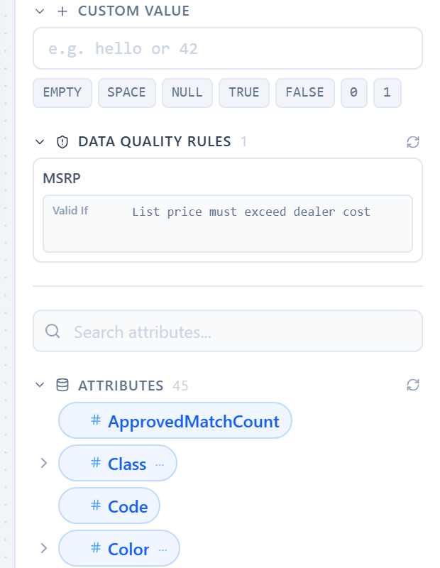
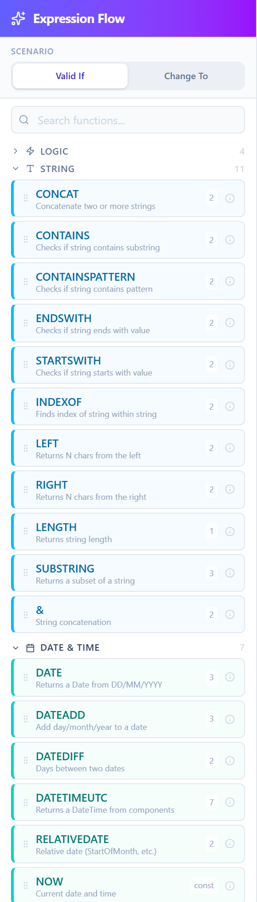
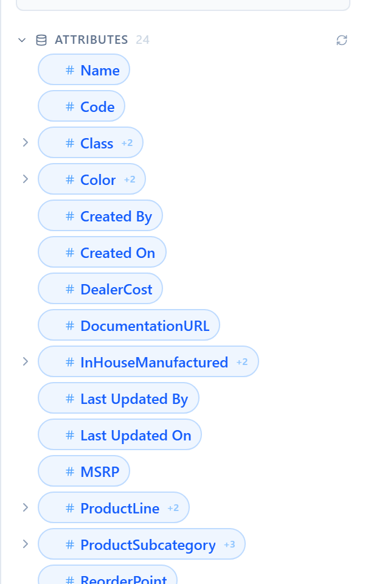
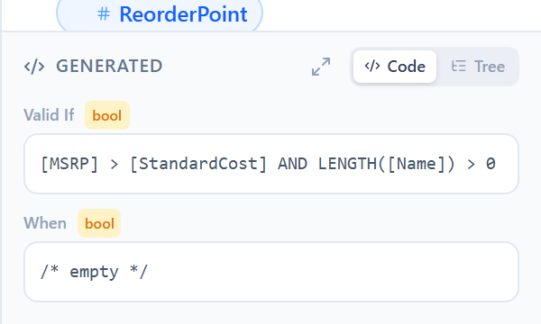
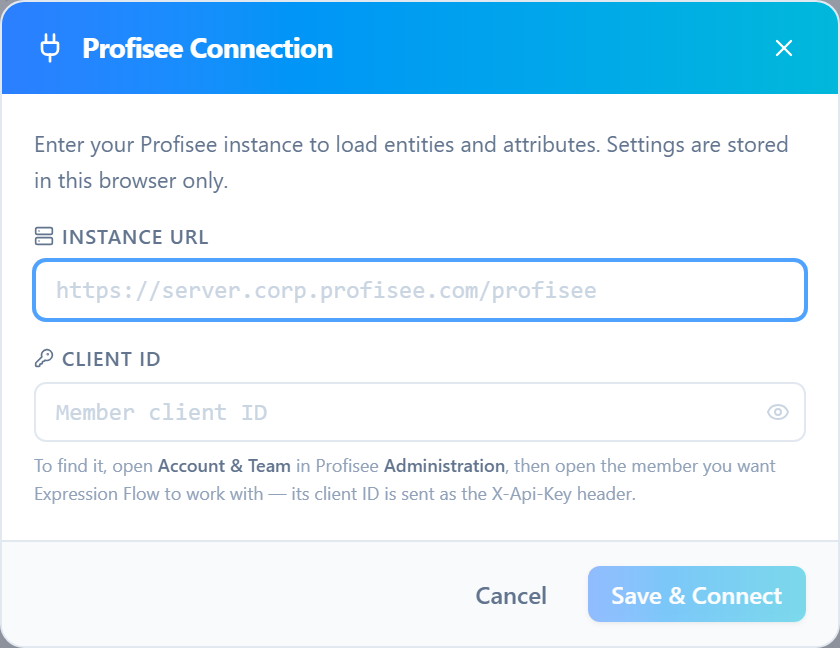

<div align="center">

# Expression Flow

**Build Profisee business rules visually — drag blocks instead of writing expression syntax.**

[Live instance](https://corpltr50.corp.profisee.com/expression-flow/) · [Presentation slides](Expression-Flow-Hackathon-Presentation.pdf)

</div>

---

Profisee business rules are written as text expressions. That works fine until the
rule grows three functions deep and someone else has to change it. Expression Flow
turns the same rule into a block tree you can see: drag attributes and functions
into place, watch the generated expression update live, and save it straight back
to a Profisee entity.



## What it does

- **Composes rules from blocks** — 43 building blocks across 9 categories (logic,
  string, date & time, change detection, conversion, set operations, comparison,
  arithmetic, grouping), each typed so mismatched pieces are caught as you build.
- **Round-trips existing expressions** — paste rule text you already have and it
  parses into blocks, so Expression Flow works on your current rules, not just new ones.
- **Generates the expression live** — the exact text Profisee will run, always visible.
- **Reads your real model** — entities, attributes, and related-entity attributes
  (`[Class].[Name]`) are pulled from a connected Profisee instance.
- **Saves back to Profisee** — write the finished rule to an entity attribute,
  optionally as a constraint.
- **Runs without a connection** — bundled demo catalogs let you explore offline.

## The two rule scenarios

Expression Flow covers both shapes a Profisee rule takes.

**Valid If** — a boolean rule that flags records failing validation, with an
optional `When` guard scoping which records it applies to. Below, list price must
beat standard cost and the name must be filled in, checked only on in-house products:



**Change To** — a value expression that rewrites an attribute, paired with the
`When` condition that decides which records get rewritten. Here, a product `Code`
is rebuilt from its related Class and Color names whenever it doesn't already match:



## Saving rules back to Profisee

With a live instance connected, the canvas isn't a scratchpad — the rule you build
is written to the platform as a real Data Quality Rule. Pick the attribute it
attaches to, give data stewards a display text, and create it:



The rule is created against the selected entity and confirmed in place:

<div align="center">
  
</div>

Rules already defined on the entity are listed in the **Data Quality Rules**
section, loaded live from the instance alongside its attributes:

<div align="center">
  
</div>

## A closer look

<table>
<tr>
<td width="33%" valign="top">

**Typed block library**

Every function carries its arity and description; categories are colour-coded so a
date block never reads as a string block.

</td>
<td width="33%" valign="top">

**Your live data model**

Attributes come from the connected instance. Expandable rows reach through
relationships to related-entity attributes.

</td>
<td width="33%" valign="top">

**Generated expression**

The rule as Profisee will evaluate it — as code or as a tree — updating on every edit.

</td>
</tr>
<tr>
<td valign="top"></td>
<td valign="top"></td>
<td valign="top"></td>
</tr>
</table>

## Running it

Install [Node.js](https://nodejs.org/) (current LTS) if you don't have it, then
build the app and serve it:

```bash
npm install
npm run build
npm run preview
```

Open **http://localhost:4173/expression-flow/**.

Without a connection configured you get the bundled demo catalogs, which is enough
to try everything except saving back to Profisee.

## Connecting to Profisee

On first load — or via the gear icon in the **Data & Values** panel — enter your
instance URL and a client ID. Settings are stored in your browser only.

<div align="center">
  
</div>

To find the client ID: open **Account & Team** in Profisee **Administration**, then
open the member you want Expression Flow to work with. That member's client ID is
sent as the `X-Api-Key` header, so the rule reads and writes with that member's
permissions.

## Checks

```bash
npm test      # vitest, single run
npm run lint  # eslint
```

CI runs the tests and the build on every pull request into `main` and on every push
to `main` (`.github/workflows/ci.yml`).
